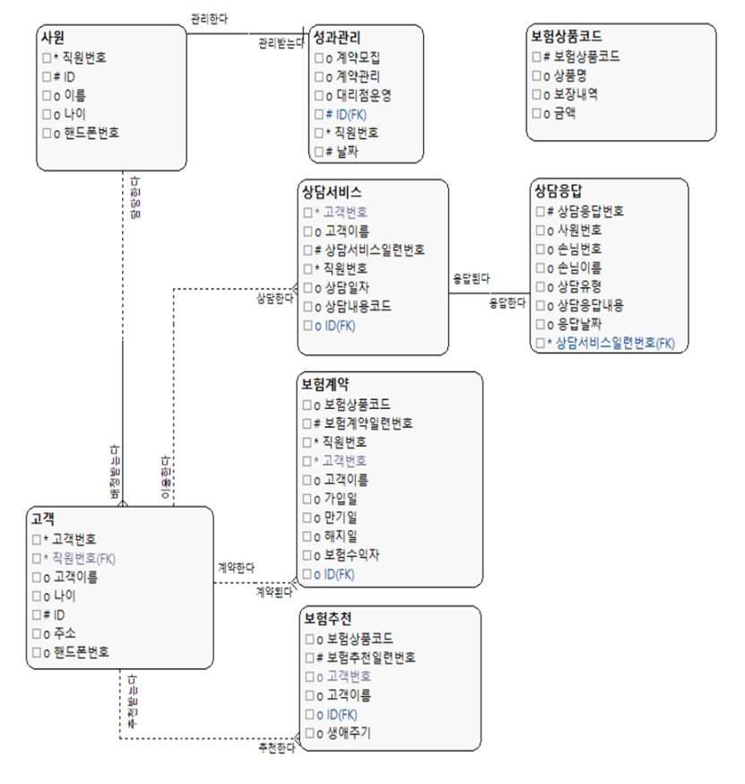

# 프로젝트 제목
HANA4U 보험관리시스템

[프로젝트 홈페이지 - https://koposoftware.github.io/template/](https://koposoftware.github.io/template/)

# 1. 프로젝트 개요

배경설명
고아계약 : 담당자가 사라진 보험계약 
보험고아 : 고아계약으로 피해 본 손님 
하나생명의 보험설계사 1년이상 정착율은 25%대로서 다른 경쟁 보험사에 비해 평균 이하인 지표를 보여주고 있다. 생명보험의 경우 손해보험보다  
지불해야 하는 비용도 더 크기 때문에 고아계약에 민감할 수 밖에 없다고 생각했다. 이에 대해 자신을 관리해주는 직원이 보이고 알맞은 서비스를  
받는다면 손님은 더 많은 보험 서비스를 이용하고, 보험의 중도 해지율도 낮아질 것이라 생각하여 다음과 같은 프로젝트를 기획하게 되었다.

HANA 4U POINT
담당자가 보이는 시스템으로서 손님이 안심하고 서비스를 이용할 수 있도록 한다.
관리기능이 추가된 홈페이지로서 사원이 담당고객에 대한 서비스 처리를 할 수 있다.

# 2. 프로젝트 제안서

ERD

 

# 3. 프로젝트 결과
발표영상
"https://www.youtube.com/watch?v=6i9u4xs3Jo8

## 발표 ppt 
[발표자료 pdf](/github.pdf) 
 

# 4. 본인 소개

본인 소개를 추가하세요

|이름 |문건모|
|연락처 | gmoon0619@naver.com|
|skill set| Frontend - HTML, CSS, Javascript|
| | Backend - Java, Spring, Oracle|
|자격증|  SCBP,SCSBA,ADSP|
|수상| |
|특기사항|  TOEIC 810 |

# 5. 기타
그외 프로젝트를 더욱 설명할수 있는 것들을 추가하세요
 
